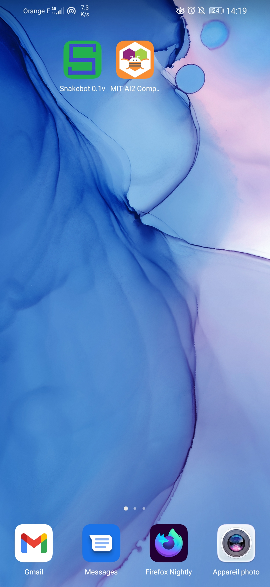
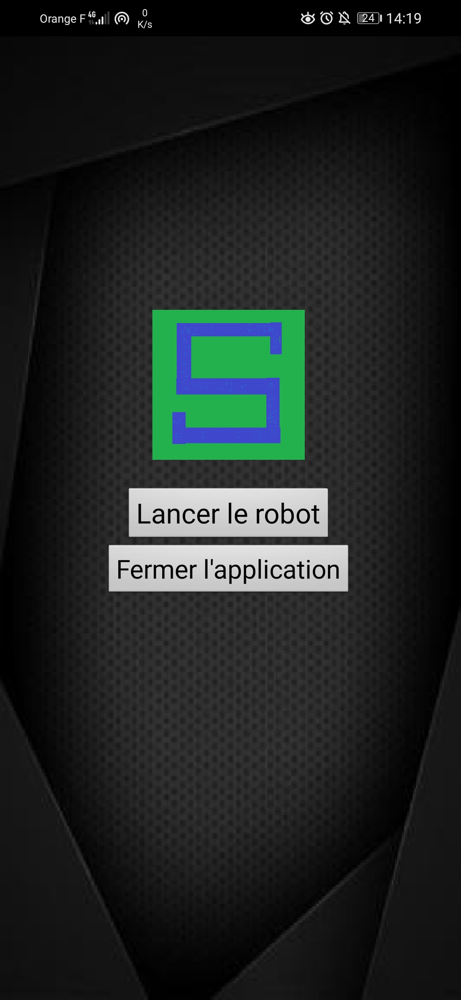

# 🐍 Snakebot 

<h3> Le robot "Snakebot" a but de chercher des victimes dans des accidents causé par des situations météorologiques (orgaes, seismes, tornades) ou bien dans des maisons incendiés.
Snakebot est une application android crée avec MIT App Inventor 2 qui permet de piloter le robot nommé "Snakebot" grâce à le téléphone Android. Ce dernier comporte un module Bluetooth, un module de GPS, un microcontrôleur : Arduino UNO R3, un led RGB (vert) qui indiquera le fonctionnement d'un Snakebot. 
Et Du point de vue d'un designer d'un robot, il semblerait qu'il contient une chenille en caoutchouc et certains parties seront en aluminium.
Dans cette application, il y aura 2 "Screens" pour l'accueil et le mode pilotage avec un navigation GPS localisé grâce à ton position GPS ou bien d'un module GPS.             [Mise à jour le 10/05/2021] </h3>

# 🔌 Les composants
| Composants        | Quantité           | Prix  | Caractéristiques        | 
| ------------- |:-------------:| -----:| :-----------------------:
| Module Bluetooth HC-06     | 1| 15€ | Le module Bluetooth HC-06 permet d'établir une liaison Bluetooth (liaison série) entre une carte Arduino et un autre équipement possédant une connexion Bluetooth (Smartphone, tablette, seconde carte Arduino, etc...). Le module HC-06 est un module "esclave" contrairement au module HC-05 qui est "maître". Un module "maître" peut demander à un autre élément Bluetooth de s'appairer avec lui alors qu'un module "esclave" ne peut recevoir que des demandes d'appairage.     |
| Module Grove GPS      | 1 |   20€ | Sensibilité: -160 dBm, Faible consommation: 40mA max. sous 3Vcc, Configurable de 4800 Baud à 57600 Baud, Protocoles supportés: NMEA et U-Blox, Ce module intègre un récepteur GPS avec antenne déportée qu'il vous sera possible de raccorder à une platine Arduino, Raspberry, BeagleBone Black, mbed, PHPoC ou CB210 au travers d'une platine "Shield" intermédiaire |
| 1 Led RGB Grove 101020472 | 1 |    4€ | Alimentation: 3,3 et 5 Vcc, Consommation: 20 mA, Résistance ajustable: 1 kΩ, Dimensions: 40 x 20 x 15 mm, Interface: digitale compatible Grove, Module led RGB 8 mm est compatible Grove, le réglage de la couleur se fait par 3 potentiomètres sur le circuit imprimé et l'intensité lumineuse à partir d'une sortie PWM d'un microcontrôleur (Arduino, Seeeduino, etc.).  |
| Arduino Uno Rev3 | 1 | 20€ | Microcontroleur accès pour tous et compatible pour ces composants, Alimentation : via port USB ou 7 à 12 V sur conencteur alim (Tension d'alimentation mini et maxi 6-20 V, Microprocesseur : ATMega328, Mémoire : 32 kB / SRAM = 2 kb / EEPROM = 1 kb, dimensions : 74 x 53 x 15 mm |
| Moteurs | ? | ? | ? | 
## ❓ C'est quoi MIT App Inventor 2 ?

<h3> App Inventor pour Android est une application développée par Google. Elle est actuellement entretenue par le Massachusetts Institute of Technology (MIT).
Elle simplifie le développement des applications sous Android et le rend accessible même pour les novices et ceux qui ne sont pas familiers avec les langages de programmation. </h3>

 Wikipedia : https://fr.wikipedia.org/wiki/App_Inventor 

 Mit App Inventor 2 : https://appinventor.mit.edu/ 

## 📚 License
[MIT](https://choosealicense.com/licenses/mit/)

<h1> 
🔴🚨 Bientôt disponible l'application "Snakebot" 🔴🚨
 </h1>

